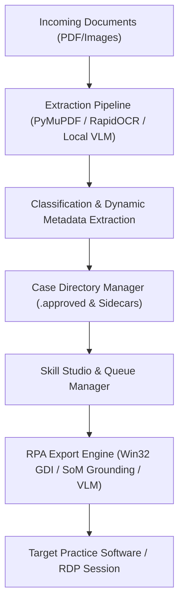

# OrdinFlow Engineering & Domain Knowledge Base

This repository knowledge base serves as persistent, high-leverage architectural memory for human engineers and AI coding agents working on **OrdinFlow**.

---

## 1. System Overview & Component Map

OrdinFlow is a privacy-first, local-first medical document processing, classification, and RPA export desktop application.



### Core Directory Layout
* [`core/skills/engines/export_engine.py`](file:///g:/Meine%20Ablage/Projekte/OrdinFlow/core/skills/engines/export_engine.py): Main RPA execution loop, action dispatcher, and step coordinate calculator.
* [`core/skills/grounder.py`](file:///g:/Meine%20Ablage/Projekte/OrdinFlow/core/skills/grounder.py): Set-of-Mark (SoM) visual badge grounding, 28px-aligned 4K quadrant tiling, and DPI-aware screen capture.
* [`core/skills/text_helpers.py`](file:///g:/Meine%20Ablage/Projekte/OrdinFlow/core/skills/text_helpers.py): Win32 Unicode keystrokes, instant clipboard paste, and `{Var|modifier}` string formatters.
* [`core/skills/window_manager.py`](file:///g:/Meine%20Ablage/Projekte/OrdinFlow/core/skills/window_manager.py): Window activation, maximize, app launch skills, `IsHungAppWindow` freeze recovery, and modal popup handling.
* [`core/skills/case_router.py`](file:///g:/Meine%20Ablage/Projekte/OrdinFlow/core/skills/case_router.py): Case folder batch routing, document type filtering, and atomic `.meta` sidecar execution tracking.
* [`core/skills/queue.py`](file:///g:/Meine%20Ablage/Projekte/OrdinFlow/core/skills/queue.py): Thread-safe background execution queue (pause, resume, cancel, retry).
* [`routes/api/skills_api.py`](file:///g:/Meine%20Ablage/Projekte/OrdinFlow/routes/api/skills_api.py): REST endpoints for Skill Studio CRUD, live element picking, queue control, and YAML roundtripping.
* [`static/js/`](file:///g:/Meine%20Ablage/Projekte/OrdinFlow/static/js/): Modular frontend controllers (`skills_tab.js`, `skills_steps.js`, `skills_queue.js`, `skills_doctypes.js`, `skills_copilot.js`, `inbox.js`, `cases.js`).

---

## 2. Critical Gotchas, Quirks & Model Constraints

### 🎯 1. Vision Model (Qwen2.5-VL / Qwen3-VL) 28px Patch Token Alignment
* **Why**: Vision Transformers utilize a $14\times14$ patch grid with a $2\times2$ spatial pooling convolution neck $\rightarrow$ effective token unit is **$28\times28$ pixels**.
* **Rule**: All screen crops, quadrant slices, and region bounding boxes MUST be rounded down to exact multiples of **28 pixels** (`(val // 28) * 28`).
* **Benefit**: Zero token padding waste in the vision encoder, zero bilinear interpolation blurring, and maximum spatial accuracy for UI element grounding.

### 🪟 2. Windows Session Isolation & Subshell Sandbox Station
* **Reality**: Agent background subshells on Windows execute inside isolated desktop station sandboxes (`exebox-...`), not on the interactive physical desktop (`WinSta0\Default`).
* **Rule**: Native Win32 UI actions (`keybd_event`, `mouse_event`, `BitBlt`) executed in background subshells interact strictly with that virtual desktop. Never falsely claim a physical monitor clicked something unless verified via Chrome DevTools MCP (which connects to the live browser via CDP WebSocket).

### 🏷️ 3. Atomic Sidecar Integrity (`.meta` files)
* **Design**: Every document PDF in a case folder has an accompanying JSON sidecar file (`<filename>.pdf.meta`).
* **Fields**:
  - `executed_skills: list[str]`: List of skill IDs that have already processed this file.
  - `skill_execution_history: dict[str, float]`: Epoch timestamps of executions.
* **Rule**: Never delete, move, or rename a PDF without synchronously updating/moving its `.meta` sidecar. Unprocessed files for a skill are strictly determined by `skill.id not in meta.executed_skills`.

### 🛡️ 4. Input Shield & Sensitive Credential Masking
* **Rule**: Plaintext passwords or sensitive credentials in Skill actions (`TYPE_TEXT` marked with `is_secret: true` or containing sensitive keys) are masked with `••••••••` in logs, frontend badges, and UI cards.
* In tests and scratch scripts, NEVER commit real passwords, API keys, or patient records.

### 📐 5. High-DPI GDI Screen Grabbing
* **Rule**: Always call `user32.SetProcessDPIAware()` before computing screen coordinates or performing BitBlt captures. Otherwise, Windows DPI virtualization scales 4K/150% scaling displays into blurry virtual 1080p buffers.

---

## 3. Anti-Patterns & Hard Code Standards

| Anti-Pattern | Correct Practice |
|---|---|
| Large files (> 800 LOC) | Modularize into SRP submodules (Enforced by [`test_architecture_guard.py`](file:///g:/Meine%20Ablage/Projekte/OrdinFlow/tests/test_architecture_guard.py)) |
| Hardcoded German symbols in Python | Strict English symbols, functions, and docstrings |
| Inventing fallback default data | Return clean empty collections `[]`, `{}` |
| Dynamic `element.style` in JS | CSS classes and design tokens in [`static/css/app.css`](file:///g:/Meine%20Ablage/Projekte/OrdinFlow/static/css/app.css) |
| Polling background loops in tools | Non-blocking execution & reactive wakeup |

---

## 4. Pre-Commit Verification Commands & Quality Gate

Always run and pass all gates with 0 errors before presenting results to the user:
```bash
venv\Scripts\ruff.exe check .
npx -y pyright@latest core/ routes/
venv\Scripts\python.exe -m pytest -q
```
**Subagent Audit Gate**: Launch `pre_commit_auditor` subagent to audit git diff, architectural compliance, and edge cases prior to asking for user commit approval.

---

## 5. Specialized Multi-Agent Quality Subagents

* **`plan_critic` ("Grill Me" Sparring Panel)**: Multi-perspective sparring partner before implementation (up to 3 subagents/iterations). Actively attacks assumptions, prevents hallucinations by verifying real codebase APIs, generates competing architectural alternatives, and enforces KISS/YAGNI. If consensus is reached, the plan is synthesized; if fundamental trade-offs remain, they are escalated transparently to the user.
* **`pre_commit_auditor` ("Grill Me" Code & Goal Auditor)**: Adversarial auditor before commit approval. Scrutinizes `git diff` against both **Plan Fidelity** (does the code genuinely fulfill `implementation_plan.md` and solve the user's root issue, without cut corners?) and **AGENTS.md standards** (no placeholders, memory/buffer cleanup, Win32 guards, SRP limits, zero synthetic secret leaks).
