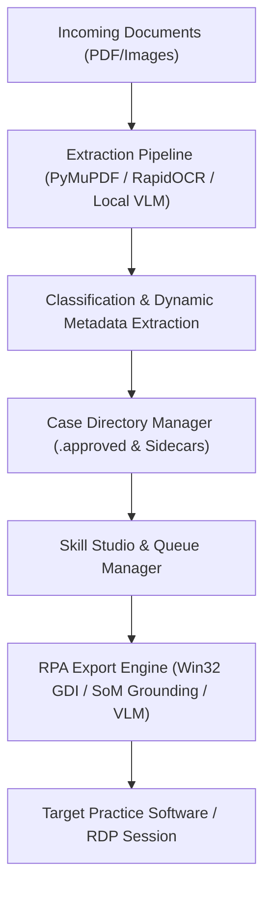

# OrdinFlow Engineering & Domain Knowledge Base

This repository knowledge base serves as persistent, high-leverage architectural memory for human engineers and AI coding agents working on **OrdinFlow**.

---

## 1. System Overview & Component Map

OrdinFlow is a privacy-first, local-first medical document processing, classification, and RPA export desktop application.



### Core Directory Layout
* [`core/extraction_pipeline.py`](../core/extraction_pipeline.py): Multi-tier consensus voting engine, spatial RapidOCR fusion, GBNF grammar constraints, and typographical casing representative election.
* [`core/skills/engines/export_engine.py`](../core/skills/engines/export_engine.py): Main RPA execution loop, action dispatcher, recursive `CALL_SKILL` invocation, and simulation `dry_run` mode.
* [`core/skills/grounder.py`](../core/skills/grounder.py): Set-of-Mark (SoM) visual badge grounding, 28px-aligned 4K quadrant tiling, multi-monitor virtual desktop capture, and Per-Monitor V2 DPI awareness cascade.
* [`core/skills/text_helpers.py`](../core/skills/text_helpers.py): Win32 Unicode keystrokes, safe 64-bit clipboard paste with prior-content restoration, 80ms yield timing, and `{Var|modifier}` string formatters.
* [`core/skills/window_manager.py`](../core/skills/window_manager.py): Window activation, maximize, app launch skills, `IsHungAppWindow` freeze recovery, and modal popup handling.
* [`core/skills/case_router.py`](../core/skills/case_router.py): Case folder batch routing, document type filtering, and atomic `.meta` sidecar execution tracking.
* [`core/skills/queue.py`](../core/skills/queue.py): Thread-safe background execution queue (pause, resume, cancel, retry).
* [`core/llm_backends.py`](../core/llm_backends.py): Local `llama-cpp-python` VRAM backend with double-checked reentrant locking.
* [`routes/api/cases_api.py`](../routes/api/cases_api.py): Case review REST endpoints with path containment guards and exponential backoff retry directory renames.
* [`routes/api/system_api.py`](../routes/api/system_api.py): Base64 `-EncodedCommand` PowerShell path pickers and system diagnostics.
* [`static/js/`](../static/js/): Modular frontend controllers (`skills_tab.js`, `skills_steps.js`, `skills_queue.js`, `skills_doctypes.js`, `skills_copilot.js`, `inbox.js`, `cases.js`, `app.js`).

---

## 2. Critical Gotchas, Quirks & Model/Platform Constraints

### 🎯 1. Vision Model (Qwen2.5-VL / Qwen3-VL) 28px Patch Token Alignment
* **Why**: Vision Transformers utilize a $14\times14$ patch grid with a $2\times2$ spatial pooling convolution neck $\rightarrow$ effective token unit is **$28\times28$ pixels**.
* **Rule**: All screen crops, quadrant slices, and region bounding boxes MUST be rounded down to exact multiples of **28 pixels** (`(val // 28) * 28`).
* **Benefit**: Zero token padding waste in the vision encoder, zero bilinear interpolation blurring, and maximum spatial accuracy for UI element grounding.

### 🖥️ 2. Windows Session Isolation & Subshell Truthfulness
* **Reality**: Agent subshells on Windows run in isolated sandbox virtual desktop stations (`exebox-...`), not in the interactive user desktop station (`WinSta0\Default`).
* **Rule**: Native OS GUI actions (`pynput`, `pyautogui`, `ctypes.windll.user32.mouse_event`, `BitBlt`) executed from background subshells interact strictly with the virtual desktop of that process and are NOT visible on the user's physical monitor.
* **Truthfulness**: Never claim a physical window was operated on the user's physical screen when executing from a subshell. Only web/browser interactions via Chrome DevTools MCP (CDP WebSocket) interact with the live user browser instance.

### 🖥️ 3. Multi-Monitor Virtual Desktop & Coordinate Translation
* **Reality**: On multi-monitor Windows setups, displays positioned to the left or above the primary monitor have negative coordinate spaces (e.g. $x_v = -1920$).
* **Rule**: Screen bounds MUST be queried using virtual desktop metrics:
  - `SM_XVIRTUALSCREEN = 76`
  - `SM_YVIRTUALSCREEN = 77`
  - `SM_CXVIRTUALSCREEN = 78`
  - `SM_CYVIRTUALSCREEN = 79`
* **Translation Offset**: The screen capture preserves `img._screen_origin = (x_v, y_v)`. `SoMGrounder.locate_target` MUST add `origin_x` and `origin_y` to target element coordinates before dispatching physical OS mouse clicks.

### 📐 4. Modern Windows DPI Awareness Cascade & GDI BitBlt
* **Rule**: Declare Per-Monitor V2 DPI awareness with progressive fallback before computing screen coordinates or capturing GDI BitBlt bitmaps:
  ```python
  # 1. Per-Monitor V2 (DPI_AWARENESS_CONTEXT_PER_MONITOR_AWARE_V2 = -4)
  user32.SetProcessDpiAwarenessContext(ctypes.c_void_p(-4))
  # 2. Per-Monitor V1 fallback
  shcore.SetProcessDpiAwareness(2)
  # 3. System DPI Aware fallback
  user32.SetProcessDPIAware()
  ```
* **Benefit**: Eliminates blur, coordinate drift, and `OSError: screen grab failed` when applications run across mixed-DPI displays (e.g. 150% 4K laptop + 100% 1080p external monitor).

### 🏷️ 5. Set-of-Mark (SoM) Top-Edge Badge Placement
* **Gotcha**: When UI elements reside at the top edge of a window or screen ($y_1 < 16$), drawing badges above the bounding box (`y1 - 14`) truncates the badge off-screen.
* **Rule**: When $y_1 < 16$, dynamically render the badge inside the top-left corner of the bounding box (`badge_top = y1`, `badge_bottom = min(y2, y1 + 14)`).

### 📋 6. Win64 Ctypes Pointer Safety & Clipboard Protocol
* **Pointer Truncation**: In 64-bit Python on Windows, `ctypes` defaults `restype` to 32-bit `c_int`. All memory handles and pointers (`GlobalAlloc`, `GlobalLock`, `GetClipboardData`, `SetClipboardData`) MUST declare `restype = ctypes.c_void_p` and explicit `argtypes` to avoid pointer truncation (`0xc0000005` access violations).
* **Clipboard Preservation & Yield Timing**:
  1. Back up existing clipboard unicode text before pasting.
  2. Use an `OpenClipboard` retry loop (5 attempts, 10ms delay) to bypass transient locks from sync utilities.
  3. Send `Ctrl+V` and enforce an **80ms yield delay** (`time.sleep(0.08)`), allowing the target application's message pump to consume `WM_PASTE` before restoring the user's prior clipboard data.

### 🧹 7. PyMuPDF (`fitz`) & OpenCV Native Buffer Hygiene & Garbage Collection
* **Buffer Cleanup**: For native C/C++ libraries (`fitz` / PyMuPDF, `cv2` / OpenCV), explicitly deallocate large native buffers (e.g. `del pix`) immediately after byte extraction.
* **Batch GC**: In long-running batch loops, trigger periodic garbage collection (`gc.collect()`) after processing each document to prevent C-heap fragmentation and OS-level access violations (`0xc0000005`).

### 📦 8. Atomic File & Sidecar (`.meta`) Integrity
* **Rule**: FileSystem operations (move, delete, split, rename) MUST handle source files and their accompanying `.meta` sidecar files atomically. Never orphan metadata during routing or case archiving.

### ⚖️ 9. Multi-Tier Consensus Mathematics & Typographical Election
* **Symbolic Tier Weights**: `ExtractionPipeline._evaluate_field_consensus` passes symbolic tier keys (`"tier1"`, `"text"`, `"tier2"`, `"tier3"`). This decouples consensus weighting ($1.0, 1.0, 1.25, 1.5$) from integer pixel dimensions configured in `config.yaml`.
* **Casing Heuristic**: When cluster vote counts and lengths tie, `_casing_score` penalizes screaming ALL-CAPS (`-10`) and rewards mixed Title Case (`+10`), ensuring clean canonical names (e.g., electing `"Mustermann"` over `"MUSTERMANN"`).
* **Substring Normalization**: Aggressive substring and token subset matching (`_are_similar_or_substring`) must remain intact for medical compound names (e.g. `'Wannink'` $\subset$ `'Bramkamp-Wannink'`).

### 🔒 10. Reentrant Locks (`RLock`) & Double-Checked Model Caching
* **Reentrant Safety**: `_CONFIG_LOCK` in `core/config.py` and `_LLM_LOCK` in `core/llm_backends.py` use `threading.RLock()`, preventing self-deadlock during nested calls.
* **Cold-Start VRAM Protection**: `_ensure_loaded()` uses double-checked locking inside `with _LLM_LOCK:` to guarantee that concurrent HTTP requests during startup instantiate exactly one LLM instance in VRAM.

### 🛡️ 11. 100% Offline Air-Gap & PowerShell Injection Defense (CWE-78)
* **Air-Gap Standard**: No external CDNs, fonts (`fonts.googleapis.com`), or cloud telemetry. The frontend uses a native system UI font stack (`-apple-system, BlinkMacSystemFont, "Segoe UI", Roboto, sans-serif`).
* **PowerShell EncodedCommand**: When invoking PowerShell subprocesses (e.g. folder pickers), escape single quotes, strip newlines, encode in UTF-16LE Base64, and pass via `powershell -NoProfile -NonInteractive -EncodedCommand <base64>`.

### 📂 12. Windows Explorer Transient Lock Resilience
* **Transient Locks**: Windows Explorer thumbnailers, indexers, or antivirus scanners temporarily hold read locks on newly processed directories.
* **Rule**: Wrap directory renames/moves in a retry helper (`_safe_rename_dir`) with exponential backoff ($0.15s \to 0.30s \to 0.60s \to 1.20s \to 2.40s$) to handle transient `PermissionError` [WinError 5 / 32].

### ⏱️ 13. Headless Background Keep-Alive Safety
* **Rule**: Server heartbeat and keepalive monitors must evaluate all dimensions of ongoing background work (active skill queues, running file processors, non-empty queues) before executing automated idle shutdowns.

### 🧩 14. KISS in Workflow & Task Editors
* **Rule**: Keep Task & Action configuration interfaces direct, transparent, and immediately editable. Avoid nested view-mode toggles (e.g. "Simple vs. Expert") or complex collapse states that hide inputs and confuse non-technical users.

### ⚡ 15. VRAM-Safe Adaptive Layer Ladder & 4096 Context Budget
* **Context Budget (`n_ctx = 4096`)**: To fit comfortably on consumer GPUs and APUs (e.g. AMD Radeon with 3.8 GB VRAM, 4GB/6GB Nvidia cards), tier dimensions MUST remain within a strict 4096-token ceiling (1,850 non-image tokens + 2,052 image tokens):
  - **Tier 1**: $1232\text{ px}$ ($868 \times 1232\text{ px} = 1{,}364\text{ Tokens}$)
  - **Tier 2**: $1372\text{ px}$ ($980 \times 1372\text{ px} = 1{,}715\text{ Tokens}$)
  - **Tier 3**: $1512\text{ px}$ ($1064 \times 1512\text{ px} = 2{,}052\text{ Tokens}$)
  - **Equidistant Scaling**: All tier dimensions scale in exact $+140\text{ px}$ ($+5$ patches) increments, perfectly divisible by 28.
* **Steeper Adaptive Layer Ladder**: `_generate_layer_candidates()` steps down via `[-1, 20, 10, 5, 0]`. On ~4GB GPUs, 10 layers offload ~1.33 GB of weights into VRAM, leaving $\approx 1\text{ GB}$ of free memory headroom for the `mmproj` vision forward pass without triggering `VK_ERROR_OUT_OF_DEVICE_MEMORY` crashes.

### 🚀 16. Zero-Setup Windows Bootstrap & GGUF Magic Integrity
* **Auto-Bootstrap**: `main.py` detects when invoked with a global Python interpreter (`sys.prefix == sys.base_prefix`) and re-executes itself inside `venv\Scripts\python.exe` (or `pythonw.exe`) before importing third-party dependencies.
* **GGUF Magic & Size Floor Verification**: `scripts/download_models.py` and `_is_valid_gguf()` check the 4-byte `b"GGUF"` magic header and enforce minimum size thresholds to detect and purge corrupted stub files (e.g. HTML 404 error pages) before feeding them to C++ `llama.cpp`.

---

## 3. Anti-Patterns & Repository Invariants

| Anti-Pattern | Correct Practice |
|---|---|
| Large files (> 800 LOC) | Modularize into SRP submodules (Enforced by [`test_architecture_guard.py`](../tests/test_architecture_guard.py)) |
| Hardcoded German symbols in Python | Strict English symbols, functions, and docstrings |
| Raw dimension integers in consensus | Symbolic tier keys (`"tier1"`, `"tier2"`, `"tier3"`) |
| Unchecked ctypes pointer returns | Declare `restype = ctypes.c_void_p` for 64-bit pointers |
| Dynamic `element.style` in JS | CSS classes and design tokens in [`static/css/app.css`](../static/css/app.css) |
| Polling background loops in tools | Non-blocking execution & reactive wakeup |
| Orphaned metadata files | Atomic sidecar (`.meta`) routing & deletion |

---

## 4. Repository Verification Commands & Quality Gate

* **Intermediate Iteration / Task Completion (Code Changes Only)**:
  ```bash
  python -m pytest -q
  ```
  - Run ONLY if application source code (`.py`, `.js`) was modified in the task.
  - Skip completely if only `.md`, documentation, or non-code configuration files were touched.
  - **Do NOT run Ruff or Pyright during iterative tasks.**

* **Pre-Commit Quality Gate (Triggered Strictly Upon Explicit Commit/Push Request)**:
  ```bash
  python scripts/verify_ci.py
  ```
  - Executed ONLY when the user explicitly instructs to commit or push (e.g., "bitte committen", "commit und push").
  - Deterministically runs:
    1. `python -m ruff check .` (Ruff Linter)
    2. `npx pyright core/ routes/` (Pyright Static Type Checker)
    3. `python -m pytest -q` (Full Test Suite, 140+ tests)

---

## 5. Specialized Multi-Agent Quality Subagents

* **`plan_critic` ("Grill Me" Sparring Panel)**: Multi-perspective sparring partner before implementation (up to 3 subagents/iterations). Actively attacks assumptions, prevents hallucinations by verifying real codebase APIs, generates competing architectural alternatives, and enforces KISS/YAGNI. If consensus is reached, the plan is synthesized; if fundamental trade-offs remain, they are escalated transparently to the user.
* **`pre_commit_auditor` ("Grill Me" Code & Goal Auditor)**: Adversarial auditor before commit approval. Scrutinizes `git diff` against both **Plan Fidelity** (does the code genuinely fulfill `implementation_plan.md` and solve the user's root issue, without cut corners?) and **AGENTS.md standards** (no placeholders, memory/buffer cleanup, Win32 guards, SRP limits, zero synthetic secret leaks).
