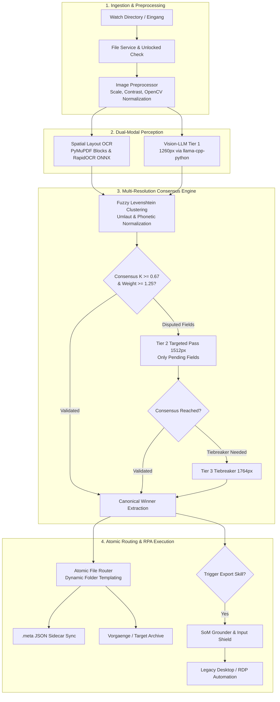

# 🚀 OrdinFlow

[](https://www.python.org/)
[](https://github.com/microsoft/pyright)
[](https://github.com/astral-sh/ruff)
[](https://pytest.org/)
[](docs/legal/PRIVACY_POLICY.md)
[](LICENSE)

> ⚠️ **Work in Progress (WIP):** This project is actively under development and may change significantly over time.

> **Autonomous Multimodal Document Management, Visual Information Extraction & Agentic RPA Orchestrator**
> *100% On-Premise · Air-Gapped & GDPR-Compliant · Dual-Engine Text & Vision Fusion · ~98% Empirical Accuracy*

---

## 📌 Executive Summary

**OrdinFlow** is an intelligent, domain-agnostic document management and orchestration system built for high-security, privacy-critical environments (healthcare practices, law firms, financial institutions, and engineering offices).

Unlike traditional cloud-dependent DMS solutions or rigid regex-based OCR tools, OrdinFlow runs **entirely on local hardware**. It combines **embedded ONNX-based deep learning OCR** with **local Vision-Language Models (VLMs)** via `llama.cpp` to classify, extract, verify, and route both structured documents and complex image collections (drawings, photos, handwritten notes, certificates, stamps).

By fusing two fundamentally distinct perception paradigms—deterministic spatial text OCR and deep multimodal visual reasoning—OrdinFlow systematically cross-verifies extractions, virtually eliminates LLM hallucinations, and achieves an empirical **~98% recognition rate**.

```
                         ┌──────────────────────────────────────────────┐
                         │              INCOMING ARTIFACTS              │
                         │   PDFs · Scans · Photos · Technical Drawings │
                         └──────────────────────┬───────────────────────┘
                                                │
                                                ▼
                         ┌──────────────────────────────────────────────┐
                         │           MULTIMODAL DUAL PASS               │
                         │  1. Spatial Layout OCR (PyMuPDF / ONNX)      │
                         │  2. Multimodal Vision-LLM (Qwen-VL via GGUF) │
                         └──────────────────────┬───────────────────────┘
                                                │
                                                ▼
                         ┌──────────────────────────────────────────────┐
                         │      MULTI-RESOLUTION CONSENSUS ENGINE       │
                         │  Levenshtein Clustering · Weighted Voting    │
                         │  Targeted Tier Escalation (1260→1512→1764px) │
                         └──────────────────────┬───────────────────────┘
                                                │
                       ┌────────────────────────┴────────────────────────┐
                       ▼                                                 ▼
        ┌─────────────────────────────┐                   ┌─────────────────────────────┐
        │       ATOMIC ROUTING        │                   │     AGENTIC RPA SKILLS      │
        │ Dynamic Path Templating     │                   │ Set-of-Mark (SoM) Grounding │
        │ JSON Sidecar Metadata Sync  │                   │ Legacy Desktop & RDP Export │
        └─────────────────────────────┘                   └─────────────────────────────┘
```

---

## 🌟 Key Capabilities & Architectural Highlights

### 👁️ 1. Multimodal Perception: Beyond Text to Visual Information
OrdinFlow is not limited to text-heavy documents. It treats every file as a rich multimodal canvas:
- **Comprehensive Document & Image Processing:** Ingests PDFs, high-resolution scans, JPEG/PNG image collections, architectural drawings, medical reports, and photo attachments.
- **Visual Element Extraction:** Detects physical signatures, official stamps, visual checkmarks, table structures, and handwritten annotations that standard OCR engines fail to parse.
- **Domain-Agnostic Flexibility:** Define custom extraction targets for any domain (e.g., invoices, patient records, inspection protocols, certificates) purely via declarative YAML.

### 🛡️ 2. Dual-Technology Fusion & Anti-Hallucination (~98% Accuracy)
A critical flaw of standalone generative LLMs is hallucination; a critical flaw of raw OCR is lack of semantic comprehension. OrdinFlow solves this by combining two independent engines:
1. **Embedded Spatial OCR Engine (RapidOCR / ONNX Runtime):** Extracts exact layout-aware text tokens and bounding box coordinates `[pos: y=..., x=...]` without external binary dependencies (no Tesseract installation required).
2. **Local Vision-LLM (Qwen-VL / Llama-Vision via GGUF):** Interprets semantic context, resolves abbreviations, and identifies visual artifacts.
3. **Cross-Engine Verification:** The extracted data is cross-referenced across both modalities. Discrepancies trigger automated consistency checks, yielding a proven **~98% empirical accuracy rate**.

### ⚖️ 3. Multi-Resolution Consensus & Targeted Escalation
To minimize GPU compute overhead and memory pressure on local hardware, OrdinFlow implements a smart 3-tier escalation pipeline:

$$\text{Consensus Metric } K(f) = \frac{\sum_{i \in \text{winner}} w_i}{\sum_{j \in \text{all}} w_j} \ge 0.67$$

- **Tier 1 (Dual-Source Base):** Evaluates spatial OCR text ($w=1.0$) against a 1260px visual image pass ($w=1.0$).
- **Targeted Tier 2 (1512px, $w=1.25$):** If any field has confidence $K(f) < 0.67$ or low evidence weight, **only the disputed fields** are re-queried at higher resolution.
- **Targeted Tier 3 Tiebreaker (1764px, $w=1.5$):** Resolves edge-case ambiguities.
- **Fuzzy Clustering:** Levenshtein distance clustering with German umlaut normalization (`ä` $\to$ `ae`), phonetic tolerance, and canonical scoring (vote weight $\to$ string length $\to$ casing).

### 🤖 4. Agentic RPA with Set-of-Mark (SoM) Grounding
Many enterprise and healthcare systems (e.g., legacy practice management software, ERPs) lack REST APIs and run inside Remote Desktop (RDP) or Citrix sessions:
- **Set-of-Mark (SoM) Visual Grounding:** Segments UI elements and overlays numbered badges `[1]`, `[2]` on candidate buttons and inputs, allowing the Vision-LLM to click and navigate legacy software without brittle hardcoded pixel coordinates.
- **Crash-Safe Input Shielding:** Protects automation execution with a Windows `BlockInput` context manager and registered `atexit` emergency unblock hooks to prevent user interference or deadlocks.
- **Built-in Skill Recorder:** Interactively captures user workflows and generates reusable, declarative RPA skill YAML scripts.
- **Automated Failure Diagnostics:** Automatically saves annotated diagnostic screenshots to `scratch/rpa_failures/` upon step failure.

### 🔒 5. 100% Local, Air-Gapped & Zero Data Leakage
- **GDPR / DSGVO & HIPAA Compliant:** No data ever leaves the local network.
- **Zero Cloud API Dependencies:** Runs locally on consumer and workstation GPUs (NVIDIA RTX series, Apple Silicon, or CPU fallback) via quantized GGUF models.

---

## 🏗️ System Architecture & Data Flow



---

## 💻 Tech Stack & Engineering Decisions

| Component | Technology | Rationale & Engineering Advantage |
| :--- | :--- | :--- |
| **Language** | Python 3.10+ | Modern typing support, native concurrency, rich scientific ecosystem. |
| **VLM Inference** | `llama-cpp-python` / GGUF | In-process native C++ inference; eliminates external heavy model servers and minimizes VRAM footprint. |
| **Models** | Qwen 2.5 / 3-VL (8B) | State-of-the-art visual document reasoning and multilingual comprehension. |
| **OCR Engine** | RapidOCR (`onnxruntime`) | Lightweight deep-learning OCR in ONNX format; zero system `.exe` dependencies (cross-platform, zero setup). |
| **PDF & Graphics** | PyMuPDF (`fitz`), OpenCV, PIL | Fast C-backed PDF rendering, contour detection, and spatial block extraction. |
| **Web Dashboard** | Flask, HTML5, Vanilla JS, CSS3 | Clean, dependency-light presentation layer without fragile npm/node build chains. |
| **Static Typing** | Microsoft Pyright | Enforces strict type consistency across all core orchestrators and routes. |
| **Code Quality** | Ruff, Bandit, Pytest | High-velocity linting, security scanning, and 100% automated test coverage across all routing logic. |

---

## 📁 Repository Structure

```
OrdinFlow/
├── core/
│   ├── config.py                 # Central typed runtime configuration (AppConfig)
│   ├── extraction_pipeline.py    # 3-tier multi-resolution consensus & fuzzy clustering
│   ├── file_service.py           # Atomic file operations, PDF splitting & unlocked checks
│   ├── image_processing.py       # OpenCV preprocessing, contour detection & scaling
│   ├── llm_backends.py          # Abstract LLM backend (llama_cpp vs. OpenAI API server)
│   ├── matcher.py                # Directory tree matcher & fuzzy folder resolution
│   ├── processor.py              # Main document processing orchestrator & queue manager
│   ├── routing.py                # Path rendering engine & filename templating
│   ├── skill_recorder.py         # Live mouse/keyboard recorder with OCR element snippets
│   ├── utils.py                  # Sidecar helpers, sanitization & date normalizers
│   ├── vision.py                 # VLM prompt formatting, JSON extraction & doc schemas
│   └── skills/                   # Agentic RPA execution engine
│       ├── grounder.py           # Set-of-Mark (SoM) UI segmentation & badge overlay
│       ├── manager.py            # Skill catalog loader & lifecycle manager
│       ├── queue.py              # Skill execution task queue & state machine
│       ├── shield.py             # Crash-safe BlockInput context manager
│       └── engines/              # Specialized RPA export & import engines
├── routes/                       # Flask REST API endpoints & UI handlers
│   └── api/                      # Cases, documents, inbox, skills & system telemetry APIs
├── static/ & templates/          # Modern web dashboard UI & stylesheet
├── settings/                     # Declarative application configuration
│   ├── config.yaml               # System runtime configuration
│   └── skills/                   # Declarative YAML skill definitions
├── tests/                        # Comprehensive automated Pytest test suite (100+ tests)
└── main.py                       # CLI & background orchestrator entrypoint
```

---

## ⚙️ Declarative Configuration Example

OrdinFlow is completely domain-agnostic. No document types or extraction schemas are hardcoded.

### Document Schema Definition (`settings/skills/import_eingang.yaml`)
```yaml
document_types:
  Arztbrief:
    description: "Medical specialist report or consultation letter"
    extraction_fields:
      Nachname: "Patient last name"
      Vorname: "Patient first name"
      Geburtsdatum: "Patient date of birth in DD.MM.YYYY format"
      Dokumentendatum: "Document or consultation date"
    validation:
      signature_required: false
      optional_fields: ["Geburtsdatum"]

  Rechnung:
    description: "Commercial invoice or fee statement"
    extraction_fields:
      Rechnungsnummer: "Invoice identifier"
      Gesamtbetrag: "Total invoice amount including currency"
      Rechnungsdatum: "Invoice issuance date"
    validation:
      signature_required: false
```

### Routing & Folder Template (`settings/config.yaml`)
```yaml
watch_dir: ./Eingang
target_base_dir: ./Vorgaenge
folder_delimiter: "__"
folder_structure:
  - "{Dokumentendatum}"
  - "{Nachname}_{Vorname}"
  - "{Document}"
```

---

## 🚦 Quality Assurance & CI Verification

OrdinFlow follows strict engineering standards. Every release and commit passes local CI verification gates:

```bash
# 1. Strict Linter & Code Style Check
ruff check .

# 2. Static Type Analysis
npx pyright core/ routes/

# 3. Comprehensive Automated Test Suite (100+ tests)
python -m pytest -q
```

---

## 🚀 Quickstart Guide

### Prerequisites
- **Python 3.10+** (64-bit)
- **Local Vision-LLM (GGUF):** Place your vision model (e.g., `Qwen3-VL-8B-Instruct-UD-Q4_K_XL.gguf` + `mmproj-BF16.gguf`) in the `models/` directory.

### Installation
```bash
# Clone the repository
git clone https://github.com/DanAzanza/OrdinFlow.git
cd OrdinFlow

# Setup virtual environment and install dependencies
python -m venv venv
source venv/bin/activate  # On Windows: venv\Scripts\activate
pip install -r requirements.txt
```

### Running the System
```bash
# Start background worker and web dashboard
python main.py
```
Open [http://127.0.0.1:8080](http://127.0.0.1:8080) in your browser to access the dashboard.

---

## 🛡️ License & Commercial Inquiries

Copyright (c) 2026 **Daniel Azanza Hartmann**.
This project is open-source under the **GNU Affero General Public License v3 (AGPL-3.0)**. See the [LICENSE](LICENSE) file for details.

*Note: PyMuPDF is licensed under GNU AGPL v3. Any distribution or network deployment of derivative works must comply with AGPL-3.0 terms.*

### 💼 Commercial Licensing & Custom Deployments
For commercial entities, healthcare networks, or legal practices requiring a closed-source license, custom integration, or proprietary on-premise deployments exempt from copyleft obligations, please connect via [LinkedIn](https://www.linkedin.com/in/daniel-azanza/).

