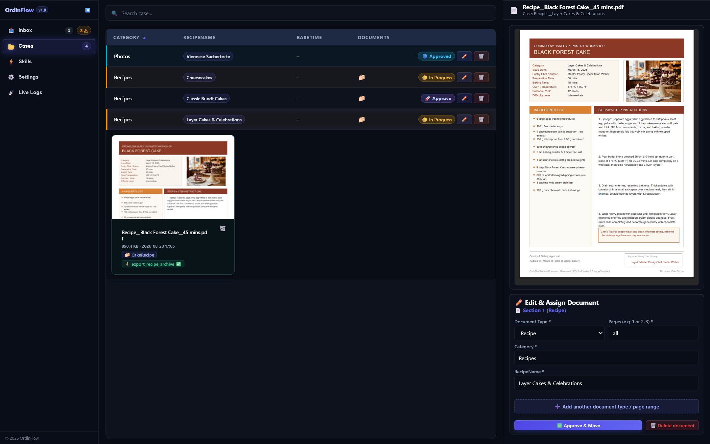
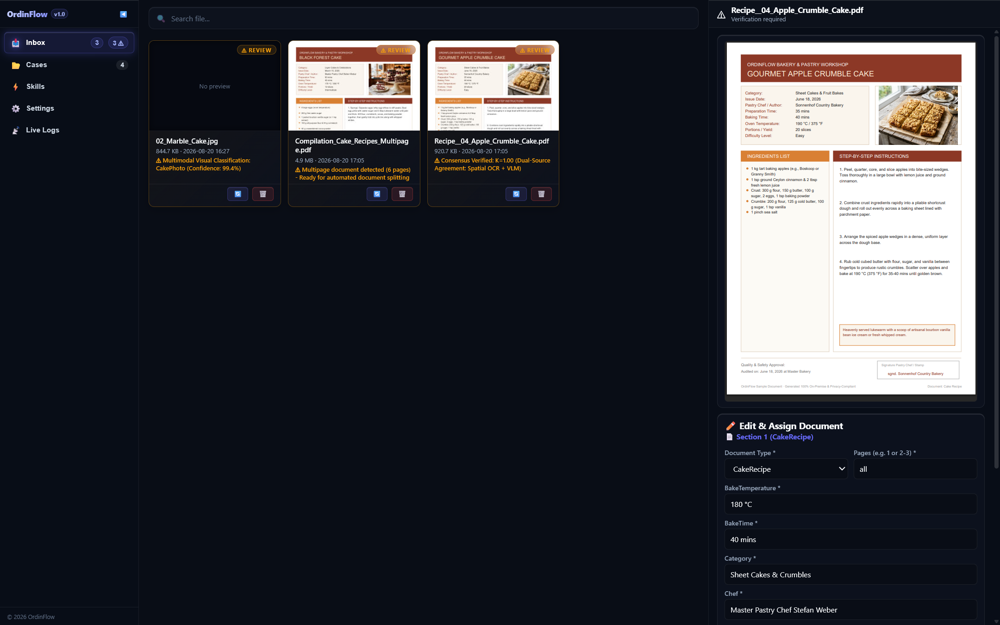
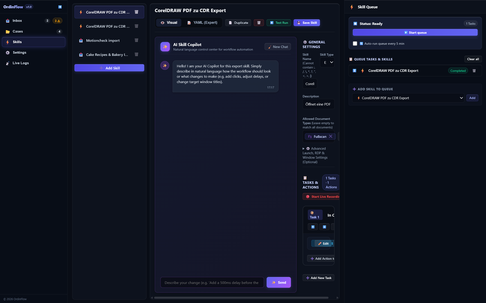
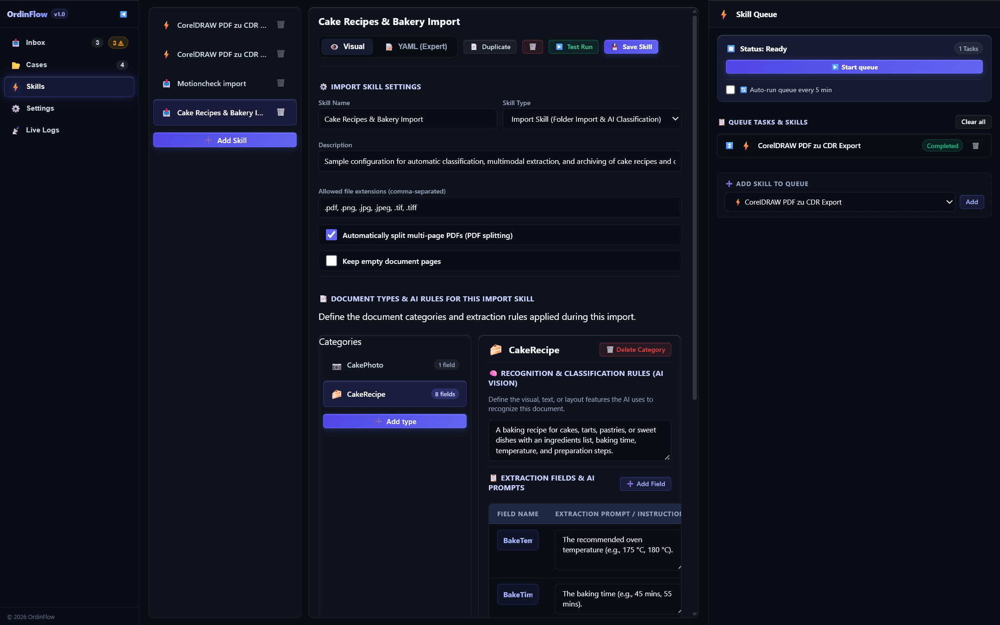
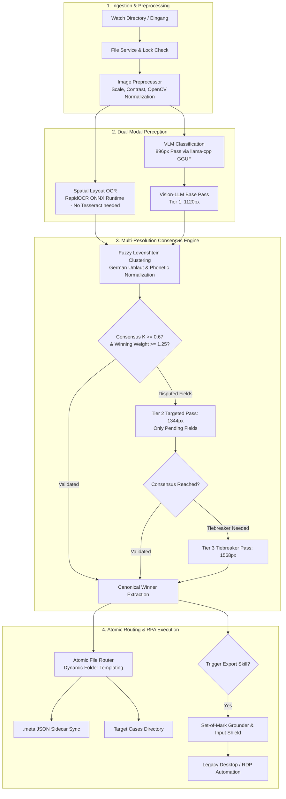

# 🚀 OrdinFlow

<div align="center">

[](https://www.python.org/)
[](https://github.com/microsoft/pyright)
[](https://github.com/astral-sh/ruff)
[](https://pytest.org/)
[](docs/legal/PRIVACY_POLICY.md)
[](LICENSE)

**Autonomous Multimodal Document Management, Visual Information Extraction & Agentic RPA Orchestrator**  
*100% On-Premise · Air-Gapped & GDPR-Compliant · Dual-Engine Text & Vision Fusion · ~98% Consensus Accuracy*  
**Designed & Engineered by Daniel Azanza Hartmann**

<br />

[](docs/images/dashboard_cases.png)
*OrdinFlow Web Dashboard: Automated case filing, extracted metadata chips, status indicators, and live document inspector.*

</div>

---

## 📌 Why OrdinFlow?

Enterprises, healthcare facilities, legal practices, and engineering offices face a critical dilemma: **Modern document processing needs AI, but sending confidential files to cloud APIs is a legal and operational dealbreaker.**

OrdinFlow solves the **three fatal flaws** of existing document management solutions:

```
┌───────────────────────────────────────────────┐     ┌────────────────────────────────────────────────┐
│             THE 3 FATAL TRAPS                 │     │             THE ORDINFLOW SOLUTION             │
├───────────────────────────────────────────────┤     ├────────────────────────────────────────────────┤
│ 1. THE CLOUD PRIVACY TRAP                     │ ──► │ 100% On-Premise & Air-Gapped                   │
│    Sending unredacted patient records or      │     │ Zero data leaves your network. Fully compliant │
│    contracts to US clouds violates GDPR/HIPAA.│     │ with GDPR, HIPAA, and German § 203 StGB.       │
├───────────────────────────────────────────────┤     ├────────────────────────────────────────────────┤
│ 2. THE HALLUCINATION & FRAGILITY TRAP         │ ──► │ Dual-Engine Cross-Verification (~98% Acc.)     │
│    Raw LLMs hallucinate critical numbers;     │     │ Spatial ONNX OCR + Multimodal Vision-LLM       │
│    pure OCR fails on handwriting & stamps;   │     │ fused through a 3-tier consensus engine.       │
│    regex breaks on the slightest layout shift.│     │                                                │
├───────────────────────────────────────────────┤     ├────────────────────────────────────────────────┤
│ 3. THE LEGACY SOFTWARE GAP                    │ ──► │ Agentic RPA with Set-of-Mark (SoM) Grounding   │
│    Most medical/ERP software lacks REST APIs   │     │ Vision-guided desktop automation that navigates│
│    and runs inside Windows desktop/RDP apps.  │     │ and types into legacy software autonomously.   │
└───────────────────────────────────────────────┘     └────────────────────────────────────────────────┘
```

---

## ⚔️ Competitive Battle Card: How OrdinFlow Compares

| Feature / Dimension | 🚀 OrdinFlow | 📄 Paperless-ngx | ☁️ Cloud Document AI<br>*(Azure / AWS / Google)* | 🏢 Enterprise DMS<br>*(DocuWare / d.velop)* |
| :--- | :--- | :--- | :--- | :--- |
| **Data Sovereignty & Air-Gap** | 🟢 **100% Local & Air-Gapped**<br>No cloud keys, zero leakage | 🟢 **100% Local** | 🔴 **Cloud-Dependent**<br>Third-party servers & US cloud risk | 🟡 **Hybrid / Cloud-First**<br>Often requires cloud sync |
| **Perception Architecture** | 🟢 **Dual-Pass Fusion**<br>Spatial ONNX OCR + Local VLM | 🟡 **Text-Only OCR**<br>Tesseract / ocrmypdf | 🟢 **Cloud Vision-LLM**<br>High quality, but remote | 🟡 **Zonal OCR Templates**<br>Rigid, breaks on layout change |
| **Visual Element Reasoning** | 🟢 **Native**<br>Stamps, signatures, drawings, photos | 🔴 **None**<br>Discards non-text visual artifacts | 🟡 **Moderate**<br>Requires custom model training | 🔴 **None**<br>Pure text stream matching |
| **Anti-Hallucination Gate** | 🟢 **Consensus Engine ($K \ge 0.67$)**<br>Weighted Levenshtein clustering | ⚪ **N/A**<br>(Deterministic OCR only) | 🔴 **Raw LLM Output**<br>Prone to silent hallucinations | ⚪ **N/A**<br>(Rigid template matching) |
| **Legacy Desktop RPA Bridge** | 🟢 **Built-in Agentic RPA**<br>Set-of-Mark (SoM) visual grounding | 🔴 **None**<br>Requires webhooks or external tools | 🔴 **None**<br>Returns raw JSON only | 🟡 **Complex Add-Ons**<br>Proprietary enterprise connectors |
| **Operating Costs** | 🟢 **100% Free & Open Source**<br>Runs on consumer GPUs/CPUs | 🟢 **Free & Open Source** | 🔴 **Per-Page Pricing**<br>Recurring monthly cloud bills | 🔴 **5-Figure Licensing**<br>Heavy seat & maintenance fees |
| **Storage & Portability** | 🟢 **Transparent `.meta` Sidecars**<br>Zero database lock-in | 🟡 **Relational Database**<br>PostgreSQL / SQLite dependency | 🔴 **Cloud SaaS Silo**<br>Vendor lock-in | 🔴 **Proprietary DB Silo**<br>Closed schema |
| **Deployment Complexity** | 🟢 **1-Click Batch / Zero-Setup**<br>Auto-detects GPU; no Docker/Redis | 🟡 **Multi-Container Stack**<br>Docker, Redis, Celery, DB | 🟢 **Web Console**<br>(at the cost of privacy) | 🔴 **Heavy Windows Server**<br>Multi-tier IT deployment |

---

## 🌟 Visual Feature Tour

### 1. Intelligent Cases Explorer & Dynamic Categorization
OrdinFlow routes incoming documents dynamically into structured directory hierarchies based on extracted metadata (e.g., `Recipes__{Category}` or `{Date}__{LastName}_{FirstName}`). Every document is accompanied by an open `.meta` JSON sidecar file that preserves full lineage, field-level confidence, and execution history.

<div align="center">

[](docs/images/dashboard_cases.png)
*Interactive Cases Explorer: Categorized folders, metadata chips, approval toggles, and instant PDF inspection drawer.*

</div>

- **Dynamic Folder Hierarchies:** Templated directory generation using arbitrary metadata fields.
- **Sidecar Metadata Sync:** Zero vendor lock-in; metadata is saved directly alongside files as human-readable JSON.
- **Granular Approval Lifecycle:** Mark cases as approved or revoke access with a single click before export skills trigger.

---

### 2. Real-Time Inbox Review & Dual-Pass Verification
The Inbox view provides live oversight over all ingested documents. If a document has ambiguous fields or requires human validation, OrdinFlow presents a side-by-side inspection view with field-level confidence ratings and extracted values.

<div align="center">

[](docs/images/dashboard_inbox.png)
*Inbox Review: Real-time dual-pass consensus verification (K=1.00), confidence tags, and built-in document editor.*

</div>

- **Field-Level Confidence Badges:** Visual indicators highlighting fields verified across both OCR and Vision-LLM.
- **Multipage Splitting:** Automatically detects and splits multi-document PDF collations into individual case files.
- **One-Click Rapid Assignment:** Manually review, adjust, or reprocess files with instant live feedback.

---

### 3. Agentic RPA Copilot & Conversational Skill Studio
Enterprise workflows don't end at document extraction; the extracted data must enter line-of-business software. When target systems lack REST APIs, OrdinFlow's **Agentic RPA** steps in:

<div align="center">

[](docs/images/skill_studio.png)
*Conversational Skill Studio: AI Copilot on the left for natural-language workflow editing; visual RPA task builder and queue manager on the right.*

</div>

- **Set-of-Mark (SoM) Visual Grounding:** Segments GUI elements and overlays numbered badges (`[1]`, `[2]`), allowing the Vision-LLM to interact with desktop applications inside RDP or Citrix sessions without brittle pixel coordinates.
- **Conversational AI Copilot:** Edit, refine, and dry-run automation steps through an interactive natural-language chat interface.
- **Crash-Safe Input Shielding:** Protects automation runs with Windows `BlockInput` context managers and registered `atexit` emergency unblock hooks.

---

### 4. Visual Schema Builder & Domain-Agnostic Skills
Define new document types, recognition rules, and extraction fields in seconds without writing code:

<div align="center">

[](docs/images/skill_studio_schema.png)
*Visual Schema Builder: Custom document types, semantic extraction prompts, and validation rules.*

</div>

---

## 🏗️ System Architecture: The Multi-Resolution Consensus Pipeline

OrdinFlow combines two fundamentally distinct perception models to eliminate hallucinations and achieve **~98% empirical accuracy** on structured administrative documents:


```mermaid
flowchart TD
    subgraph INGESTION ["1. Ingestion & Preprocessing"]
        IN[Watch Directory / Eingang] --> W[File Service & Lock Check]
        W --> PREP[Image Preprocessor\nScale, Contrast, OpenCV Normalization]
    end

    subgraph DUAL_PERCEPTION ["2. Dual-Modal Perception"]
        PREP --> OCR[Spatial Layout OCR\nRapidOCR ONNX Runtime - No Tesseract needed]
        PREP --> CLASSIFY[VLM Classification\n896px Pass via llama-cpp GGUF]
        CLASSIFY --> VLM1[Vision-LLM Base Pass\nTier 1: 1120px]
    end

    subgraph CONSENSUS ["3. Multi-Resolution Consensus Engine"]
        OCR & VLM1 --> CLUST[Fuzzy Levenshtein Clustering\nGerman Umlaut & Phonetic Normalization]
        CLUST --> EVAL{Consensus K >= 0.67\n& Winning Weight >= 1.25?}
        EVAL -- Disputed Fields --> VLM2[Tier 2 Targeted Pass: 1344px\nOnly Pending Fields]
        VLM2 --> EVAL2{Consensus Reached?}
        EVAL2 -- Tiebreaker Needed --> VLM3[Tier 3 Tiebreaker Pass: 1568px]
        EVAL -- Validated --> WIN[Canonical Winner Extraction]
        EVAL2 -- Validated --> WIN
        VLM3 --> WIN
    end

    subgraph ROUTING_RPA ["4. Atomic Routing & RPA Execution"]
        WIN --> ROUTE[Atomic File Router\nDynamic Folder Templating]
        ROUTE --> SIDE[.meta JSON Sidecar Sync]
        ROUTE --> ARCHIVE[Target Cases Directory]
        WIN --> SKILL{Trigger Export Skill?}
        SKILL -- Yes --> SOM[Set-of-Mark Grounder & Input Shield]
        SOM --> RDP[Legacy Desktop / RDP Automation]
    end
```

### The Consensus Metric

$$\text{Consensus Metric } K(f) = \frac{\sum_{i \in \text{winner}} w_i}{\sum_{j \in \text{all}} w_j} \ge 0.67 \quad (\text{with required winning weight } \ge 1.25)$$

1. **Classification Pass (896px):** Determines document type (`Invoice`, `MedicalReport`, `Recipe`, etc.).
2. **Tier 1 Base Pass (1120px, $w=1.0$):** Spatial OCR and Vision-LLM independently extract layout tokens and semantic values.
3. **Targeted Tier 2 Pass (1344px, $w=1.25$):** If any field has confidence $K(f) < 0.67$, *only the disputed fields* are re-evaluated at higher resolution.
4. **Targeted Tier 3 Tiebreaker (1568px, $w=1.5$):** Resolves fine-grained edge-case ambiguities.

---

## ⚡ 3-Minute Quickstart

OrdinFlow is designed for zero-friction setup. You can install and run the entire platform with one click, or use standard CLI commands.

### Option A: Windows 1-Click Launchers (Recommended)

1. **Install (`Install_OrdinFlow.bat`):**  
   Double-click `Install_OrdinFlow.bat`.  
   - Automatically checks for 64-bit Python 3.10+.
   - Creates the virtual environment (`venv`).
   - Automatically detects your hardware (NVIDIA CUDA 12.4, AMD/Intel Vulkan, or CPU fallback) and installs pre-built binary wheels (no C++ compiler or CUDA toolkit required).
   - Installs all dependencies and downloads the validated local Vision-LLM (`Qwen3-VL-4B-Instruct` + vision projector) automatically from HuggingFace.

2. **Start (`Start_OrdinFlow.bat`):**  
   Double-click `Start_OrdinFlow.bat`.  
   - Launches OrdinFlow in the background via `pythonw.exe` without keeping a console window open.
   - Automatically opens the Web Dashboard in your default browser at **[http://127.0.0.1:8080](http://127.0.0.1:8080)**.
   - If already running, it brings up your existing dashboard session without creating duplicate processes.

---

### Option B: Cross-Platform / Linux / macOS CLI Setup

```bash
# 1. Clone the repository
git clone https://github.com/DanAzanza/OrdinFlow.git
cd OrdinFlow

# 2. Setup virtual environment
python3 -m venv venv
source venv/bin/activate  # On Windows: venv\Scripts\activate

# 3. Run the Hardware & Environment Orchestrator
# (Detects GPU, installs pre-built wheels, dependencies & downloads models)
python scripts/setup_environment.py

# 4. Start the background orchestrator and web dashboard
python main.py
```

---

### 🍰 Testing with Bundled Sample Data

Experience the complete document classification, multimodal extraction, and dynamic routing workflow in seconds:

1. **Activate the Sample Cake Skill:**  
   Copy `sample_data/cake_recipe_skill_example.yaml` into your active skills:
   - *Windows:* `copy sample_data\cake_recipe_skill_example.yaml settings\skills\import_cake_recipes.yaml`
   - *Linux/macOS:* `cp sample_data/cake_recipe_skill_example.yaml settings/skills/import_cake_recipes.yaml`  
   *(Or import it directly via the Web Dashboard in the **Skills** tab).*

2. **Drop Sample Documents into the Inbox:**  
   Copy recipe PDFs and cake photos into your configured `Inbox/` directory (or the path configured in your dashboard settings):
   - *Windows:*
     ```cmd
     copy sample_data\recipes_pdf\Recipe__01_Black_Forest_Cake.pdf Inbox\
     copy sample_data\images\02_Marble_Cake.jpg Inbox\
     ```
   - *Linux/macOS:*
     ```bash
     cp sample_data/recipes_pdf/Recipe__01_Black_Forest_Cake.pdf Inbox/
     cp sample_data/images/02_Marble_Cake.jpg Inbox/
     ```

3. **Observe Automated Processing:**  
   Watch OrdinFlow classify the document types, extract recipe metadata (baking times, temperatures, ingredients, chef names), verify via consensus, and automatically file them into `Cases/Recipes__Layer Cakes & Celebrations/` paired with `.meta` JSON sidecars!

---

## 📁 Repository Structure

```
OrdinFlow/
├── core/
│   ├── config.py                 # Central typed runtime configuration (AppConfig)
│   ├── extraction_pipeline.py    # Multi-resolution tiers (896px → 1120px → 1344px → 1568px)
│   ├── file_service.py           # Atomic file operations, PDF splitting & lock checks
│   ├── image_processing.py       # OpenCV preprocessing, scaling & contour normalization
│   ├── llm_backends.py          # Abstract LLM backend (embedded llama_cpp vs. server)
│   ├── matcher.py                # Directory tree matcher & fuzzy folder resolution
│   ├── processor.py              # Main document processing orchestrator & queue manager
│   ├── routing.py                # Dynamic folder & filename path templating
│   ├── skill_recorder.py         # Live mouse/keyboard recorder with OCR element snippets
│   ├── state.py                  # Unidirectional state container & DMSService
│   ├── utils.py                  # Sidecar helpers, sanitization & date normalizers
│   ├── vision.py                 # VLM prompt formatting & JSON extraction
│   ├── voting.py                 # Consensus metric, Levenshtein clustering & weighted voting
│   └── skills/                   # Agentic RPA engine (grounder, manager, queue, shield)
├── routes/                       # Flask REST API endpoints & UI handlers
│   └── api/                      # Cases, inbox, skills CRUD, split & system APIs
├── static/ & templates/          # Modern web dashboard UI & stylesheet
├── settings/                     # Runtime YAML configurations & skill definitions
├── sample_data/                  # Bundled recipe PDFs, photos, scans & example skills
├── scripts/
│   ├── setup_environment.py      # Hardware auto-detection & wheel installer
│   ├── download_models.py        # Atomic model downloader with GGUF header validation
│   └── verify_ci.py              # Full CI verification runner (Ruff, Pyright, Pytest)
├── tests/                        # Comprehensive automated test suite (217+ tests)
├── Install_OrdinFlow.bat         # 1-Click Windows installer & hardware orchestrator
├── Start_OrdinFlow.bat           # 1-Click windowless background launcher
└── main.py                       # CLI & service entrypoint
```

---

## 💻 Tech Stack & Engineering Decisions

| Component | Technology | Rationale & Engineering Advantage |
| :--- | :--- | :--- |
| **Language** | Python 3.10+ (64-bit) | Modern type hints, native multiprocessing, rich scientific ecosystem. |
| **VLM Inference** | `llama-cpp-python` / GGUF | In-process native C++ inference; eliminates external heavy model servers and minimizes VRAM footprint. |
| **Vision Models** | Qwen 2.5 / 3-VL (4B / 7B) | State-of-the-art visual document reasoning and multilingual comprehension. |
| **OCR Engine** | RapidOCR (`onnxruntime`) | Lightweight deep-learning OCR in ONNX format; zero system `.exe` dependencies (cross-platform, zero setup). |
| **PDF & Graphics** | PyMuPDF (`fitz`), OpenCV, PIL | Fast C-backed PDF rendering, contour detection, and spatial block extraction. |
| **Web Dashboard** | Flask, HTML5, Vanilla JS, CSS3 | Clean, dependency-light presentation layer without fragile npm/node build chains. |
| **Static Typing** | Microsoft Pyright (Strict) | Enforces strict type consistency across all core orchestrators and routes. |
| **Code Quality** | Ruff, Bandit, Pytest | High-velocity linting, security scanning, and 100% automated test coverage across all routing logic. |

---

## 🎯 Target Domains & Real-World Use Cases

- 🏥 **Healthcare & Medical Practices:** Autonomous intake of specialist letters, lab reports, and radiological findings with strict compliance to GDPR, HIPAA, and German medical confidentiality (`§ 203 StGB`).
- ⚖️ **Legal & Notary Offices:** Processing fee statements, court orders, deeds, and contracts while preserving attorney-client privilege.
- 📐 **Engineering & Architecture:** Ingestion of technical drawings, schematics, inspection logs, and on-site photo documentation.
- 🏢 **Finance & Commercial Offices:** Invoice reconciliation, receipt sorting, and automated entry into legacy on-premise accounting software.

---

## 🚦 Quality Assurance & Testing

OrdinFlow follows strict engineering standards. Run the entire CI quality gate locally with a single command:

```bash
# Run all CI gates (Ruff Linter, Pyright Type Checker & Full Pytest Suite)
python scripts/verify_ci.py
```

Or run the individual components directly:

```bash
# 1. Fast Linter Check
ruff check .

# 2. Static Type Analysis
npx pyright core/ routes/

# 3. Automated Test Suite (217+ tests)
python -m pytest -q
```

---

## 🛡️ License & Commercial Inquiries

Copyright (c) 2026 **Daniel Azanza Hartmann**.

This project is open-source under the **GNU Affero General Public License v3 (AGPL-3.0)**. See the [LICENSE](LICENSE) file for details.

*Note: PyMuPDF is licensed under GNU AGPL v3. Any distribution or network deployment of derivative works must comply with AGPL-3.0 terms.*

### 💼 Commercial Licensing & Enterprise Deployments
For commercial entities, healthcare networks, or legal practices requiring a proprietary license, custom RPA engine integrations, or deployments exempt from copyleft obligations, please connect via [LinkedIn](https://www.linkedin.com/in/daniel-azanza-hartmann-8a7b59384/).
